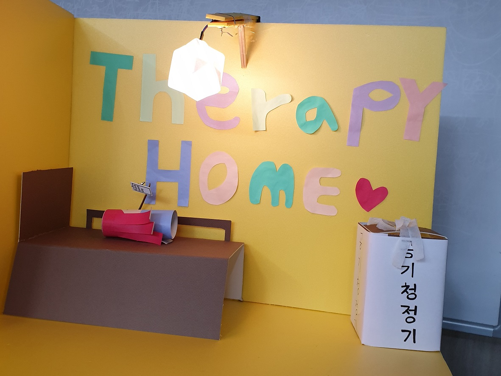
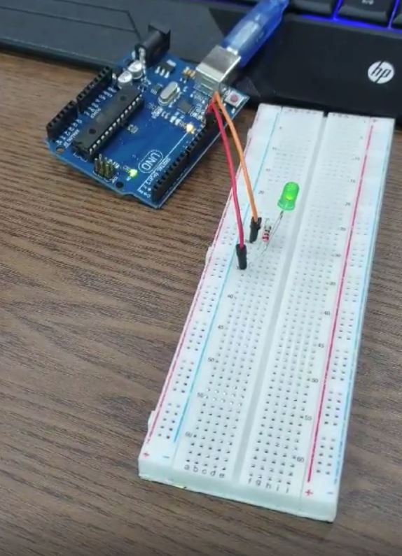
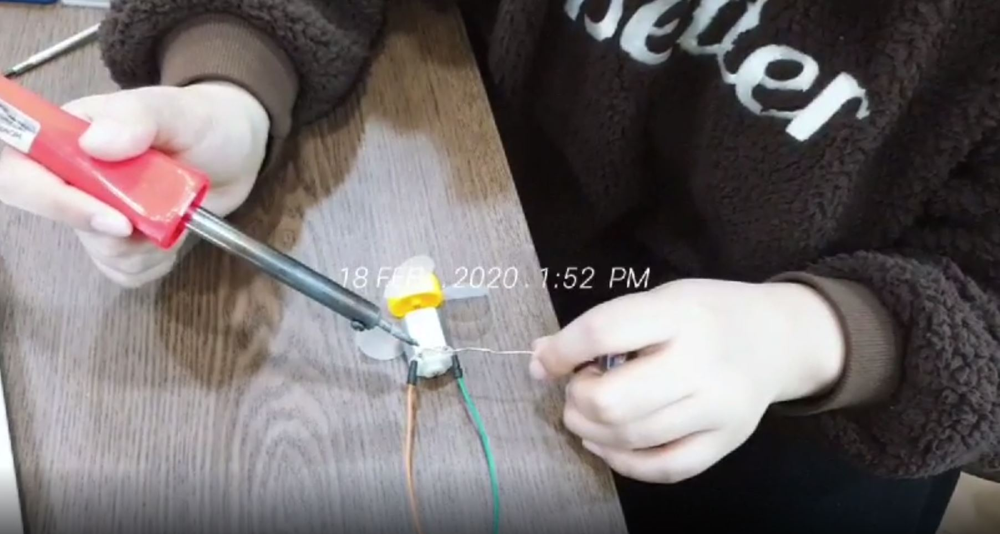

# arduino-study
사물 IoT 첫도전🙌   
아두이노를 안드로이드와 연동하여 동작해보기!   
아두이노 wifi 모듈에 조명과 선풍기팬을 달아 어플로 크고 끌 수 있도록 개발한 내용을 기록   
    
TMI.. 해커톤을 위해 제작 도중 코로나로 인해 대회가 취소되어 무산된 프로젝트... 팀프로젝트였으며 5명의 인원으로 구성되어 개발을 했고, 나는 아두이노 개발 및 안드로이드 연결하는 포지션이었다.
   
### 개발기간 : 5일   
   
### 개발후기   

처음 해보는 아두이노 개발!!!   
우선 우리 프로젝트에 필요한 아두이노 부품들을 찾아야 했다. 처음 접하는 것이었기 때문에 기초지식이 없는 상태로 아두이노에 대해 공부하며 직접 구매하러 다녔다. 빠르게 테스트를 하며 진행해야했기 때문에 낮에는 용산 전자상가에 직접 부품을 구매하러 다녔고, 밤과 새벽에는 개발에 몰두했다. 다행히 대회측에서 제공하는 예산이 있었기 때문에 쉽게 구매하고, 틀리면 재구매하며 실험을 반복할 수 있었다.   
   
아래는 개발한 순서를 되짚어 본 내용이다.   
   
1. 처음에는 일반 아두이노 보드인 `우노보드`로 `작은 LED 전구조명을 켜는 것`으로 시작
    - 인터넷에 나와있는대로 따라해보았는데 작동을 잘 했다
    
    - 여러 예제들을 계속 보면서 실험을 계속했고 공통된 지식들이 있어 습득하기 시작
    - 이 후 프로젝트에서 사용할 `LED 조명`을 연결하여 켜는데에 성공

2. 다음 과제는 `LED 조명 켜고 끄는 것을 폰에서 조작`하기   
    - 핸드폰과의 연결은 wifi 또는 블루투스로 해줘야한다는 사실을 알게 됌   
    - 블루투스 연결을 끊었다 연결했다 하면 이상하니 `wifi 로 조작`해야 한다는 생각으로 이어짐   
    - wifi 조작을 위해서는 `NodeMCU라는 Wifi 모듈 보드`를 사용하면 됌   
    - `NodeMCU`를 구매후 `wifi를 통해 컴퓨터 인터넷 창에서` LED를 켜고 끌 수 있도록 만듬   
    - 그 다음 안드로이드에 통신을 붙혀 `안드로이드로 LED 조명을 제어`함    
 

3. 마지막 과제는 `선풍기 팬을 켜고 끄는 것을 폰에서 조작`하기
    - 선풍기 팬을 돌리는 모터가 필요했는데 이 `모터에 선을 납땜` (중학생시절 기술시간 이후 오랜만의 납땜)
    
    - 모터를 on/off 하기 위해 `릴레이 모듈`을 사용
    - `안드로이드로 릴레이모듈을 제어`해서 `선풍기 on/off`    
